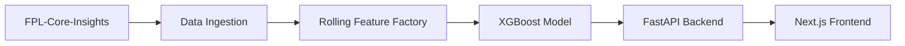

# FPL-Predictor

FPL-Predictor is a Premier League forecasting product built on top of the
[FPL Core Insights](https://github.com/olbauday/FPL-Core-Insights) data source.
It combines football data engineering, an XGBoost match model, a FastAPI backend,
and a Next.js frontend to turn raw match updates into a browsable prediction site.

## System Flow

| Layer | Responsibility |
| --- | --- |
| `FPL-Core-Insights` | Upstream source for teams, players, matches, player stats, and player match stats |
| `src/fpl_predictor/data_ingestion.py` | Pulls and normalizes season data from GitHub raw URLs |
| `src/fpl_predictor/feature_factory.py` | Builds leakage-safe rolling pre-match features |
| `src/fpl_predictor/model_training.py` | Trains and calibrates the XGBoost outcome model |
| `apps/api` + `FastAPI` | Serves live predictions, history, and lineup simulation APIs |
| `apps/web` + `Next.js` | Renders the public site for predictions and historical match browsing |

## What The Product Does

The website is designed around two simple use cases:

- browse upcoming Premier League fixtures and see calibrated home win, draw, and away win probabilities
- browse finished matches and review the key stats behind what happened

The frontend is split into three pages:

- `/`: landing page that explains the website
- `/predictions`: upcoming matches, grouped by gameweek, with arrow-based week navigation
- `/history`: finished matches, grouped by gameweek, with important stat summaries

## What Powers It

Behind the site, the project currently includes:

- automated ingestion of `teams`, `players`, `matches`, `playerstats`, and `playermatchstats`
- kickoff-time-aware rolling features for each club's previous matches
- an XGBoost result model trained on Premier League data with cup and European context
- probability calibration to improve confidence quality
- a FastAPI backend for serving dashboard, predictions, and historical match data
- a Next.js frontend deployed separately from the API

## Product Experience

### Predictions

The predictions page focuses on future Premier League fixtures.
For each match, the site presents:

- home win probability
- draw probability
- away win probability
- supporting context such as Elo, rest days, and recent xG form

### Historical Match View

The history page focuses on completed matches.
It highlights the most useful summary stats, including:

- scoreline
- expected goals (xG)
- shots on target
- big chances
- possession
- selected pre-match context

## Architecture

The product is currently split across:

- [apps/web](./apps/web): Next.js frontend
- [apps/api](./apps/api): FastAPI backend entrypoint
- [src/fpl_predictor](./src/fpl_predictor): shared ingestion, feature, training, and export logic
- [data](./data): synced datasets, features, models, and reference artifacts

## Deployment

Current deployment shape:

- frontend on Vercel: [fpl-predictor-bay.vercel.app](https://fpl-predictor-bay.vercel.app/)
- backend on Render via Docker

The frontend can either:

- read a generated local dashboard payload, or
- fetch live data from the FastAPI backend using `API_BASE_URL`

## Build Progress

All implementation notes, build steps, model metrics, ingestion details, and deployment instructions now live in:

- [build-progress/README.md](./build-progress/README.md)

## Status

The product now has:

- a live frontend structure
- a deployed backend path
- trained model artifacts
- exported prediction and historical datasets for the site
- Full data automation
