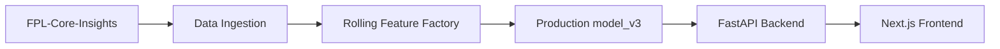

# Prem Predict

[](https://fpl-predictor-bay.vercel.app/)
[](./build-progress/README.md#phase-3b5-ratings-dixon-coles-and-model_v3)
[](./LICENSE)

Prem Predict is a Premier League match-forecasting product built on top of the
[FPL Core Insights](https://github.com/olbauday/FPL-Core-Insights) data source.
It combines football data engineering, a production `model_v3` forecasting
pipeline, a FastAPI backend, and a Next.js frontend to turn raw match updates
into a browsable prediction site. The live Render API currently serves v3.

## System Flow

| Layer | Responsibility |
| --- | --- |
| `FPL-Core-Insights` | Upstream source for teams, players, matches, player stats, and player match stats |
| `src/fpl_predictor/data_ingestion.py` | Pulls and normalizes season data from GitHub raw URLs |
| `src/fpl_predictor/feature_factory.py` | Builds leakage-safe rolling pre-match features |
| `src/fpl_predictor/model_v3.py` | Evaluates, selects, refits, and packages the production model |
| `apps/api` + `FastAPI` | Serves live predictions, history, and lineup simulation APIs |
| `apps/web` + `Next.js` | Renders the public site for predictions and historical match browsing |


```mermaid
flowchart LR
    A["FPL-Core-Insights"] --> B["Data Ingestion"]
    B --> C["Rolling Feature Factory"]
    C --> D["Production model_v3"]
    D --> E["FastAPI Backend"]
    E --> F["Next.js Frontend"]
```

## What The Product Does

The website is designed around two simple use cases:

- browse upcoming Premier League fixtures and see calibrated home win, draw, and away win probabilities
- browse finished matches and review the key stats behind what happened

The frontend is split into three pages:

- `/`: landing page that explains the website
- `/predictions`: upcoming matches, grouped by gameweek, with arrow-based week navigation
- `/history`: finished matches, grouped by gameweek, with important stat summaries

## What Powers It

Behind the site, the project currently includes:

- automated ingestion of `teams`, `players`, `matches`, `playerstats`, and `playermatchstats`
- kickoff-time-aware rolling features for each club's previous matches
- production `model_v3`, with Dixon-Coles protected by a guarded XGBoost promotion gate
- probability calibration to improve confidence quality
- a FastAPI backend for serving dashboard, predictions, and historical match data
- a Next.js frontend deployed separately from the API

## Product Experience

### Predictions

The predictions page focuses on future Premier League fixtures.
For each match, the site presents:

- home win probability
- draw probability
- away win probability
- supporting context such as Elo, rest days, and recent xG form

### Historical Match View

The history page focuses on completed matches.
It highlights the most useful summary stats, including:

- scoreline
- expected goals (xG)
- shots on target
- big chances
- possession
- selected pre-match context

## Architecture

The product is currently split across:

- [apps/web](./apps/web): Next.js frontend
- [apps/api](./apps/api): FastAPI backend entrypoint
- [src/fpl_predictor](./src/fpl_predictor): shared ingestion, feature, training, and export logic
- [data](./data): synced datasets, features, models, and reference artifacts

## Deployment

Current deployment shape:

- frontend on Vercel: [fpl-predictor-bay.vercel.app](https://fpl-predictor-bay.vercel.app/)
- backend on Render via Docker

The frontend can either:

- read a generated local dashboard payload, or
- fetch live data from the FastAPI backend using `API_BASE_URL`

### Production model: v3

Render is configured for `v3`, and `/health` reports the loaded v3 bundle.
Training evaluates the Dixon-Coles/XGBoost blend on chronological season blocks,
but promotes the blend only when its gameweek-block bootstrap confidence interval
beats Dixon-Coles. Otherwise v3 safely serves the corrected Dixon-Coles component.

Current production snapshot:

| Item | v3 status |
| --- | --- |
| Historical coverage | 33 seasons, from 1993/94 through 2025/26 |
| Finished matches in the final fit | 12,809 |
| Final evaluation | 380 matches across 38 chronological 2025/26 gameweek folds |
| Selected predictor | Dixon-Coles in all 38 folds |
| Walk-forward result | 46.84% accuracy, 1.0310 log loss, 0.2101 RPS |

The closing market remained stronger on the same replay, so the reported v3
numbers should be read as honest out-of-sample results rather than a claim that
the model beats bookmaker prices. After evaluation, the production component is
refitted on every eligible finished match; unfinished 2026/27 fixtures are used
only to produce predictions.

Train and package the production bundle locally with:

```bash
PYTHONPATH=src python3 scripts/train_model_v3.py
```

The command writes a versioned bundle manifest alongside the model. Production
bundle files are committed so Render can copy an immutable v3 release into its
Docker image. The bundle
pins the model, metrics, warmed prediction feature table, XGBoost booster, and
canonical team-key snapshot with SHA-256 hashes. Live inference loads that
exported feature table directly, so API predictions use the same rating state as
offline evaluation.

The evaluation split remains chronological, but after its metrics are recorded
the production artifact is refitted on every eligible finished match. Historical
Premier League coverage starts with Football-Data's earliest available CSV
(1993-1994), and the recent FPL-Core-Insights seasons are merged on top so their
richer rows win any overlaps. Unfinished fixtures are retained for prediction
features but never used as training targets.

To run the API against the committed production bundle, configure:

```text
MODEL_VERSION=v3
MODEL_BUNDLE_PATH=data/models/model_v3_bundle.json
BOOTSTRAP_RUNTIME_ASSETS=0
REFRESH_RUNTIME_ASSETS_ON_STARTUP=0
```

The scheduled refresh discovers new upstream seasons automatically, rebuilds the
v3 bundle, and commits it with the dashboard payload. If the bundle is
incomplete, modified, has a mismatched feature schema, or contains numeric FPL
IDs in place of canonical team keys, API startup fails instead of silently
falling back to average-team Dixon-Coles parameters.

The repository includes the original Premier League CSVs from
[Football-Data](https://www.football-data.co.uk/englandm.php) under
`data/historical/football-data/raw`: 33 seasons from 1993–94 through 2025–26,
containing 12,704 finished matches through May 24, 2026. The filenames use the
source's season codes (for example, `E0_9394.csv`). These source files are tracked;
the combined historical table and training corpus remain generated outputs.

Scheduled v3 refreshes and runtime training read this snapshot in offline mode,
regardless of file timestamps. They never contact Football-Data, even on a fresh
checkout with an empty Actions cache. Missing or invalid historical files stop
the rebuild with an error instead of silently dropping a season. Recent results
still come from FPL-Core-Insights on GitHub, so routine refreshes require GitHub
access.

To rebuild just the historical table without downloading anything, run:

```bash
python scripts/sync_historical_results.py --offline
```

When Football-Data is available, historical corrections can be downloaded with
`python scripts/sync_historical_results.py --force`. Review and commit the changed
source CSVs deliberately. `--offline` and `--force` cannot be combined. Historical
coverage remains fixed at 1993–94 through 2025–26; newer seasons come from
FPL-Core-Insights.

GitHub Actions caches only `data/cache/upstream`, including completed downloads
from failed runs. FPL-Core-Insights files are checked against the GitHub tree's
blob hashes: only new, changed, missing, or damaged CSVs are downloaded. A first
run or an evicted cache needs to download these recent files, but historical
CSVs are already supplied by checkout. Temporary HTTP errors such as 503 are
retried up to three times.

Training still uses the full historical corpus plus recent results; caching
avoids repeated network downloads, not the model fit. To force a model rebuild
when the upstream data is unchanged while retaining the download cache, run:

```bash
python scripts/run_refresh_pipeline.py --model-version v3 --force-retrain
```

`--force-sync` bypasses only the FPL-Core-Insights download cache; historical
ingestion stays offline. The scheduled job
caches only source downloads, so a failed model build or artifact push is retried
on the next run rather than being treated as a completed refresh.

## Build Progress

All implementation notes, build steps, model metrics, ingestion details, and deployment instructions now live in:

- [build-progress/README.md](./build-progress/README.md)

## Status

The product now has:

- a live frontend structure
- a deployed backend path
- a deployed v3 model bundle and trained artifacts
- exported prediction and historical datasets for the site
- full v3 data and model refresh automation
